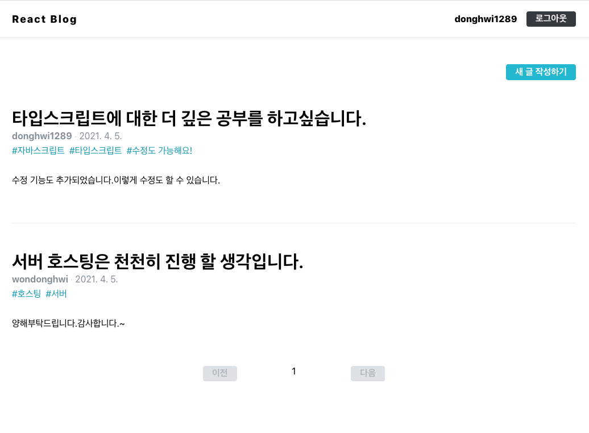
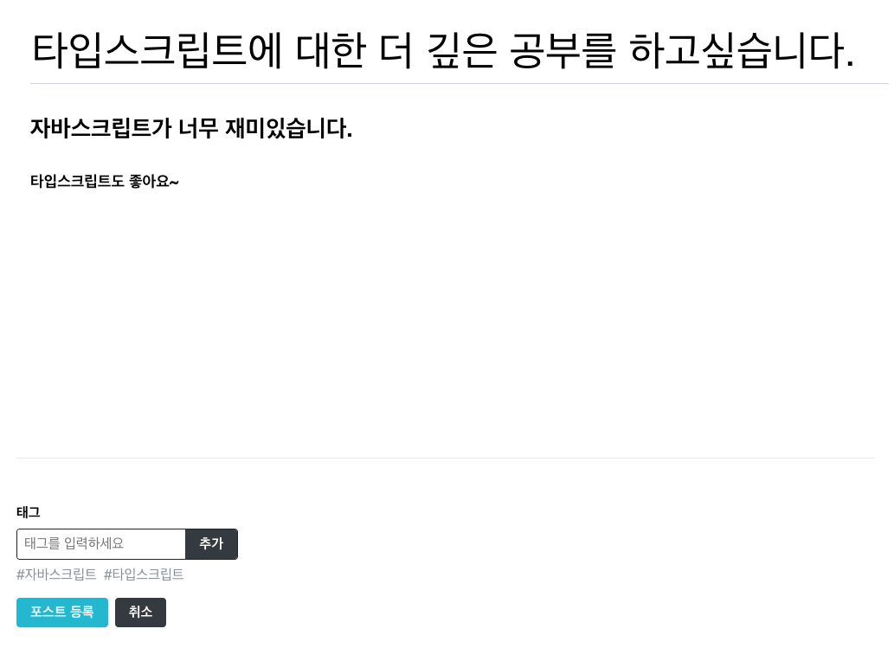
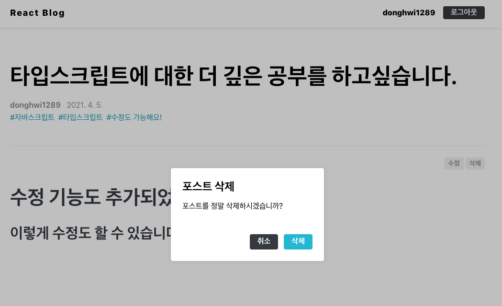
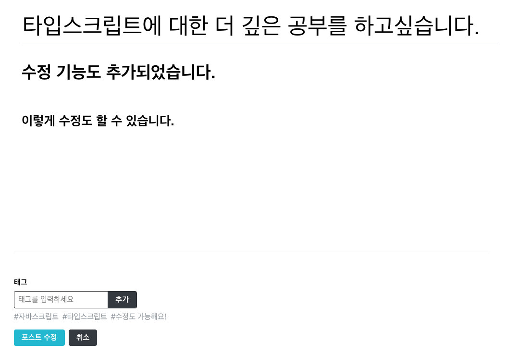
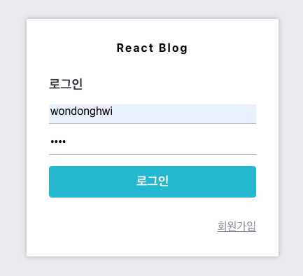
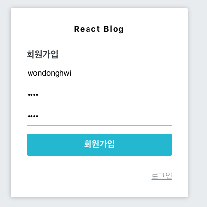

# React와 node.js를 이용한 블로그 구현 Project -> 현재 서버 호스팅X

> 기능

- 회원인증 (로그인 , 회원가입)
- 리스트 , Pagination  
- 글쓰기
- 포스트 조회 
- 수정 삭제 기능구현

> Front 기술 stack  
- React
- Redux-Saga
- ReactRouter
- styledComponents

> Back 기술 stack  
- node.js (koa)
- mongoDB

> 리스트 화면입니다. (Pagination)
> 

> 등록 화면입니다. -> editor사용가능
>

> 삭제 화면입니다.
>

> 수정 화면입니다. -> editor사용가능
>

> 로그인 화면입니다.
> 

>회원가입 화면입니다.
> 

